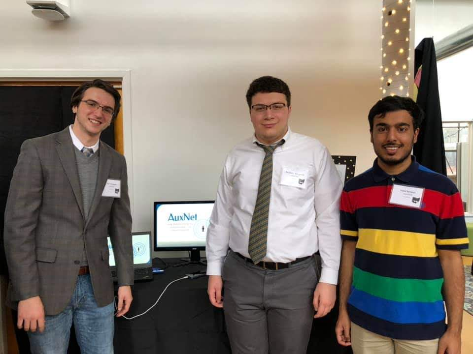

		

			

			

			

		

<section id="one">
		

			<!-- Content -->
			<h2 id="content">Background</h2>
			
AuxNet was built at <a href = "https://hack.osu.edu/2018/"> HackOHI/O 2018</a>, the biggest annual hackathon in Ohio. If you aren't familiar with a hackathon, it is a coding competition where you and your team have about 24 hours (or sometimes more) to design and build some sort of usable project. For our project, we attempted JPMorgan Chase's Disaster Recovery challenge. In particular, we wanted to focus on an application that would be useful in conditions where network connections would be unstable 

			
AuxNet uses a technology called "mesh networking", which is a sort of ad-hoc wireless network that uses the individual devices on the network as nodes. The data is sent between devices using bluetooth, which does not require internet. The data is broadcasted through the mesh, allowing data to be exchanged over practical distances. The app itself allows you to send messages to anyone else that is currently on the network. Furthermore, we implemented database synchronization between the local and cloud databases, so anyone can get all of the data that has been sent. This is theoretically highly useful for first responders who would use the application to get a better idea of where people are located in the event of a disaster. 

		

			

			<h2>The Team</h2>
		

		<ul class="actions">
					<li><a href="https://www.linkedin.com/in/zachary-allegretti-37ba18154/" class="button special" style = "margin: 1em">Zach Allegretti</a></li>
					<li><a href="https://www.linkedin.com/in/joseph-forsman-5a73a6148/" class="button special" style = "margin: 1em">Joe Forsman</a></li>
					<li><a href="#" class="button special" style="pointer-events: none;" style = "margin: 1em; pointer-events: none;">Sahil Khatri</a></li>
					<li><a href="https://www.linkedin.com/in/jackplank/" class="button special" style = "margin: 1em">Jack Plank</a></li>
		</ul>
</section>
<section class = "spotlights">
		<section>
			

				<h2>Technology Used</h2>
				<ul>
					<li>Android Studio</li>
					<li>Bridgefy</li>
					<li>SQLite</li>
					<li>Firebase</li>
				</ul>
			

		</section>
</section>

	

		

			

			

			

			

		

	

<section>
		

			<h2> Challenges </h2>
		<dl>
		<dt>Database Synchronization</dt>
			<dd>
				
Because we were operating with a global cloud database and a public database for each installation, we had to make sure that people on the network were actually receiving the correct data. To handle this, we needed to ensure that some level of database synchronization was achieved. This was further complicated by the fact that we couldn't trust our network connection, but fortunately for us Firebase had measures built in to make this easier on us.

			</dd>
			<dt>SDK Issues</dt>
			<dd>
				
There are a few different libraries for mesh networking out there, and it felt like we tried them all. Eventually we settled on Bridgefy. Although it did technically work, we ran into a lot of bugs and crashes because of this SDK. Granted, we were very unfamiliar with how it works (and we still are), but we had to implement a lot of workarounds to get it working. This was easily one of the biggest time sinks for the project

			</dd>
			<dt>Hackathon Environment</dt>
			<dd>
				
We only had 24 hours to put this whole project together, so naturally some of the design decisions were rushed. Furthermore, sleep deprivation eventually took its toll. By the time we got to hour 18, we were pretty wiped out and the bugs were not going away.

			</dd>
		</dl>
		

</section>
<section class = "spotlights">
		<section>
			

				<h2>Results</h2>
				
Despite the problems we had, we were still proud of the end product because its the technology behind it is actually unique. We had to give a presentation and demo to a few different sets of judges, who evaluated the app based on several criteria. To our surprise, we actually ended up placing 3rd for "Most Impactful". At an event with 667 hackers competing on various projects, we didn't think we would actually win anything. We had to go up on stage and give a short presentation on our project to a room full of people and receive our prize. At that point, we had been awake for about 30 hours.

				
In Spring 2019 we received an invitation to show our product at ShowOHI/O 2019, which is a showcase event for the various projects and startups being built around OSU. Although we weren't interested in going anywhere with the project, it was still a great chance to network and show off what we built. 

			

		</section>
</section>

	

		
 

	

				<i>The team after accepting our prizes at HackOHI/O 2018.  From left to right: Sahil Khatri, Zach Allegretti, Joe Forsman. Not pictured: Jack Plank.</i>

	

		
 

	

				<i>The team at our ShowOHI/O booth.  From left to right: Joe Forsman, Zach Allegretti, Sahil Khatri. Not pictured: Jack Plank.</i>

