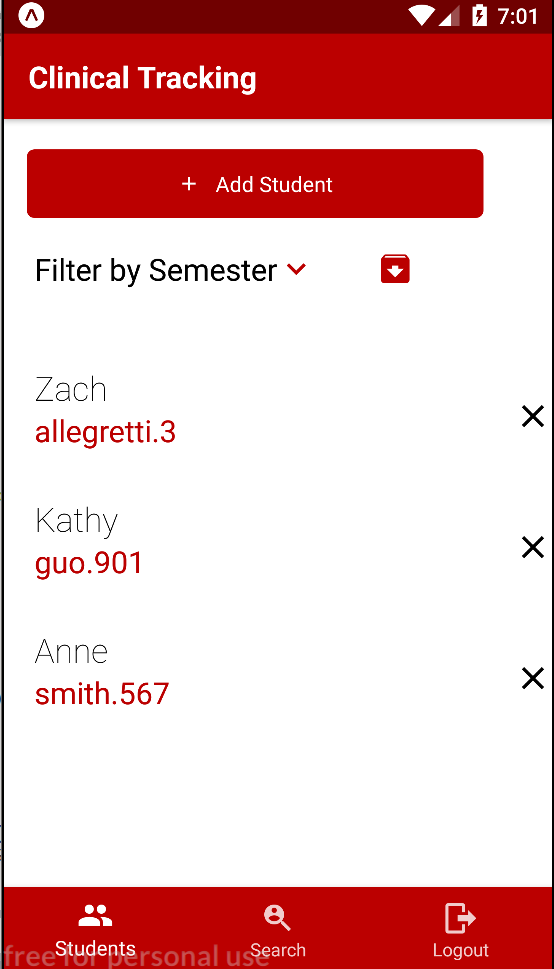
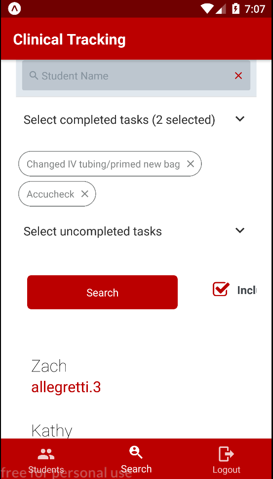
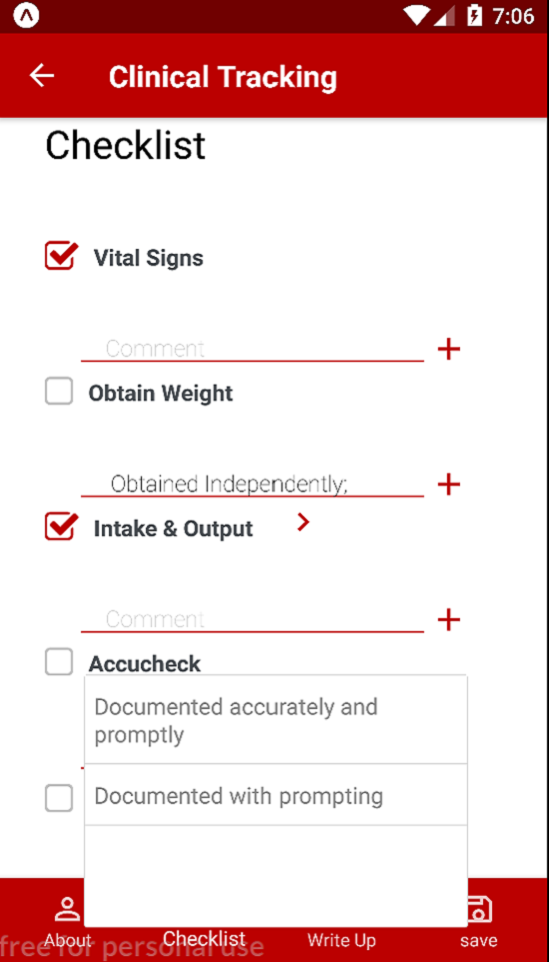

		

			

			

			

		

	

	<!-- One -->
	<section id="one">
		

			<!-- Content -->
			<h2 id="content">Background</h2>
			
Every CSE student at OSU is required to take one of the many capstone classes during their senior year. The main idea of capstone is that you work on a project that will allow you to demonstrate everything that you have learned during your 4 years at the Univesity. I took the software engineering capstone, which required you to work with a 3rd party sponsor to elicit the project requirements

			
My project was sponsored by Erik and Sinead Yarberry from the OSU College of Nursing. They wanted an application that would allow their instructors to fill out and store their evaluation forms on tablets so they could move away from their paper system. This was a brand-new project with no code written at the start. 

		

		

			<h2>The Team</h2>
			<ul class="actions">
					<li><a href="https://www.linkedin.com/in/kathy-guo/" class="button special">Kathy Guo</a></li>
					<li><a href="https://www.linkedin.com/in/ryan-whitney-847226132/" class="button special">Ryan Whitney</a></li>
					<li><a href="#" class="button special" style="pointer-events: none;">Matthew Chan</a></li>
					<li><a href="https://www.linkedin.com/in/zachary-allegretti-37ba18154/" class="button special">Zach Allegretti</a></li>
			</ul>
		

	</section>
	<section class = "spotlights">
		<section>
			

				<h2>Technology Used</h2>
				<ul>
					<li>React Native</li>
					<li>Expo</li>
					<li>SQLite</li>
					<li>Node JS</li>
					<li>Jest</li>
					<li>PM2</li>
				</ul>
			

		</section>
	</section>
	

		

			

			

			

			

			

			

		

	

	<section>
		

			<h2> Challenges </h2>
		<dl>
		<dt>OSU Authentication</dt>
			<dd>
				
One of the key features the sponsor requested was adding the ability to authenticate via OSU credentials. This would allow instructors to seamlessly adopt the new application while also reducing the amonut of data we would be responsible for. Actually getting this to work was a long series of events, but Ryan and Kathy worked tirelessly to figure it out. The tools we could use to configure authentication were restricted by the College of Nursing.

			</dd>
			<dt>Adjusting to React Native</dt>
			<dd>
				
React Native is a strange framework. I've done my fair share of native Android applications, but React was a completely different experience. The lack of built-in components was strange and I felt like we were dependent of the existence of 3rd party libraries for anything non-trivial. Fortunately, there is a lot of stuff out there for React Native.

			</dd>
			<dt>Database</dt>
			<dd>
				
We ran into a few issues configuring SQLite for the application, which required some slight restructuring and reworking of things. We had actually intended to start with a NoSQL cloud database, but the sponsor suggested we start with something local to prevent the scope from growing out of control.

			</dd>
		</dl>
		

	</section>
	<section class = "spotlights">
		<section>
			

				<h2>Results and Future Work</h2>
				
The clients were absolutely thrilled with the progress we made. My favorite part about this project was seeing how much this project meant to them as we continued to add new features. The sponsors planned to run a trial with a few instructors from the college of nursing to get feedback then hand the project over to a new capstone team in the fall. The project was so successful that we won a "Best in Class" award at the Autumn 2018 CSE Capstone Showcase.

				
There were several features we did not have time to implement. There is only so much you can do in a semester, especially when you are starting from scratch.

				<ul>
					<li>Server-side persistent storage</li>
					<li>Customizable forms</li>
					<li>Database sync between device and server </li>
					<li>Login on multiple devices</li>
				</ul>
			

		</section>
	</section>
	

