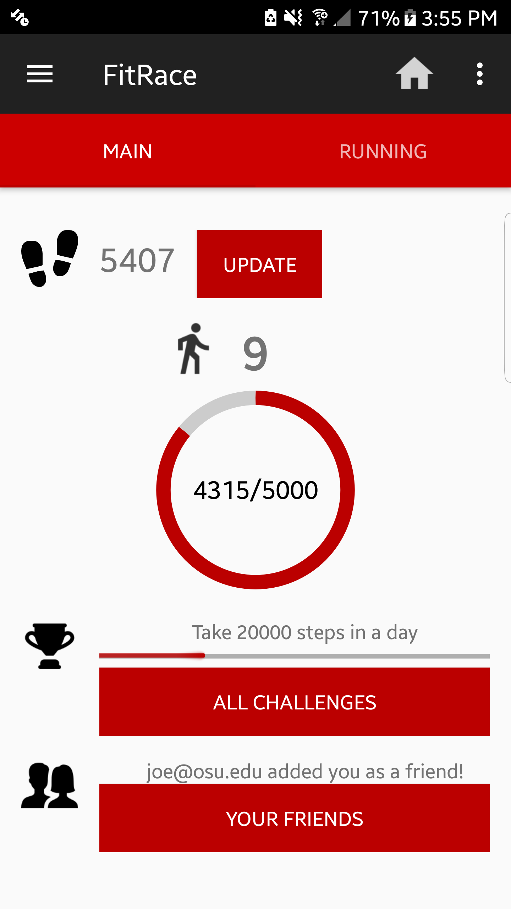
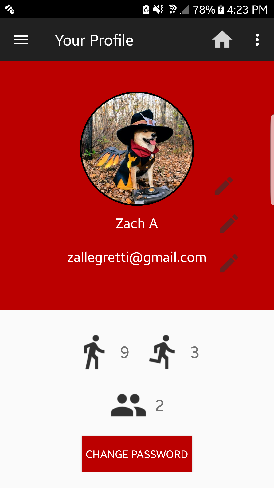
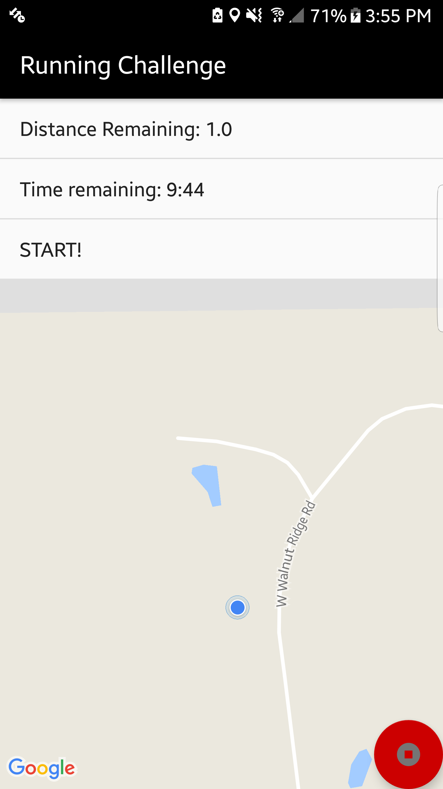

		

			

			

			

		

	<section id="one">
		

			<!-- Content -->
			<h2 id="content">Background</h2>
			
This app started as a class project for CSE 5236: Mobile Application Development in the Spring 2018 semester. The purpose of the app is to "gamify" fitness by tracking the user's steps and rewarding them with experience points, which are used to determine their level. In order to make things more interesting, you can friend other users so you can compare levels as a form of competition. In order to give the user a more concrete goal, I added implemented challenges that will let you earn bonus experience, as well as stat tracking that let you see your step count in a graphical format. 

			
Along the step counting, FitRace also features a run tracking feature that lets the user attempt various challenges where they have to run a given distance in a certain period of time. As they are running, they can see their time and distance remaining, as well as a map showing them the path they have taken. To encourage users to try out all of the different running challenges, I added a leaderboard system that lets users see how their records compare with their friends and the world.

			
After the class was over, I continued development over the summer, where I added several new features (such as the leaderboards and stat tracking). Harshil did not wish to continue development, but I made sure to credit him within the app. Once I had finished adding all of the main functionality, I ran a beta test with some friends to reveal hidden bugs and get suggestions for improvement. After the beta, I launched the app to the Google Play Store.

		

		

			<h2>The Team</h2>
		

		<ul class="actions">
					<li><a href="https://www.linkedin.com/in/zachary-allegretti-37ba18154/" class="button special" style = "margin: 1em">Zach Allegretti</a></li>
					<li><a href="https://www.linkedin.com/in/harshil-amin-a97417106/" class="button special" style = "margin: 1em">Harshil Amin</a></li>
		</ul>
	</section>
	<section class = "spotlights">
		<section>
			

				<h2>Technology Used</h2>
				<ul>
					<li>Android Studio</li>
					<li>Google Fit</li>
					<li>Google Maps</li>
					<li>Firebase</li>
				</ul>
			

		</section>
	</section>
	

		

			

			

			

			

		

	

	<section>
		

			<h2> Challenges </h2>
		<dl>
		<dt>Tracking Steps Correctly</dt>
			<dd>
				
There are a lot of edge cases involved with tracking and processing user step data. For example, you need to consider the difference in steps since the last time the API call was made, roll-over of steps between days, and the user's device being powered off. Furthermore, it would be naive to only check in steps when the user launches the app. To solve this problem, the app will run a task in the background every 3 hours that processes the user's steps. Furthermore, this process will continue to be scheduled even if the app is turned off. 

			</dd>
			<dt>Google Fit Authentication</dt>
			<dd>
				
To use Google Fit data, the user must connect their Google account to the app. This did not cause any issues at first, but once I got to the beta testing stage, nobody was able to connect their Google account! The issue ended up being with the OAuth Client ID I needed to use Google Fit. Somehow this was only affecting the release verison of the app and not the debug version, which is why the bug wasn't occurring during development.

			</dd>
			<dt>Balancing the Game</dt>
			<dd>
				
This wasn't a technical challenge, but more of a design consideration. I had to do a lot of experimentation in order to figure exactly how much each step should be worth and how to balance out the progression of levels. This also had to apply to the challenges, which I wanted to be rewarding for the user but not cause them to immediately gain several levels.

			</dd>
		</dl>
		

	</section>
	<section class = "spotlights">
		<section>
			

				<h2>Results</h2>
				
This app is still live on the Google Play Store! I'm not actively working on it anymore, but it still funtions normally. It's completely free to download and there are no adds or purchases, so give it a shot!

				<ul class="actions"> 
					<li><a href="https://play.google.com/store/apps/details?id=com.harshil.zach.fitnesstracker&hl=en_US" class="button special">Download on Google Play</a></li>
				</ul>		
			

		</section>
	</section>

