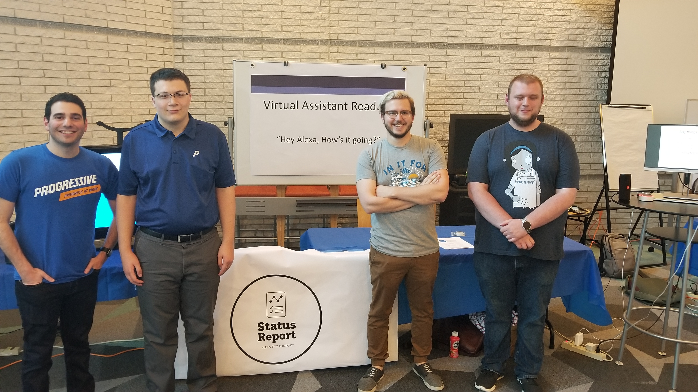
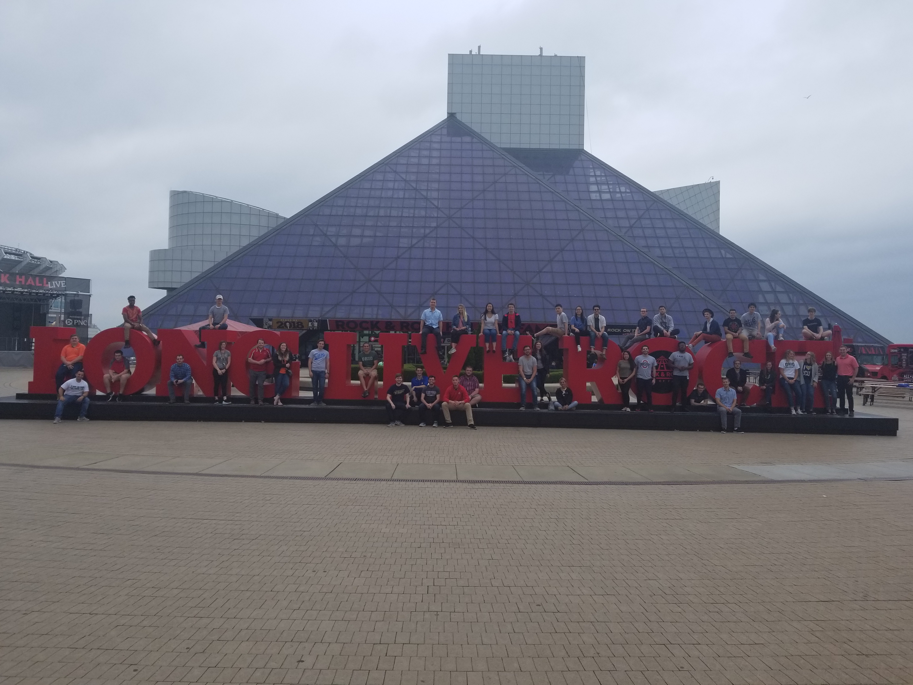
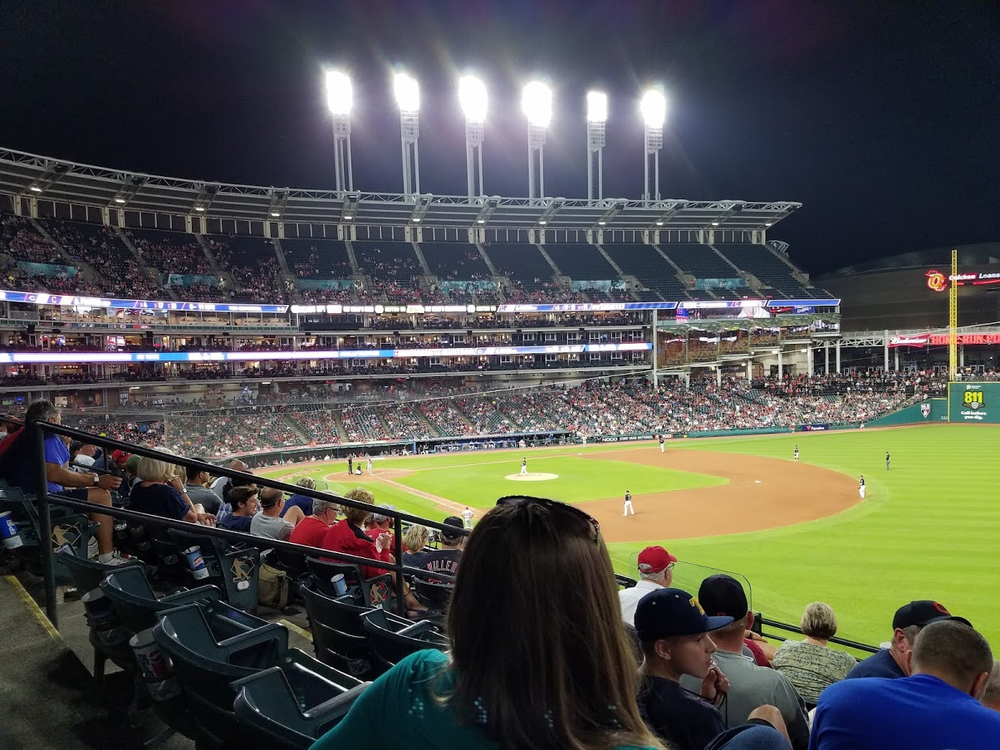
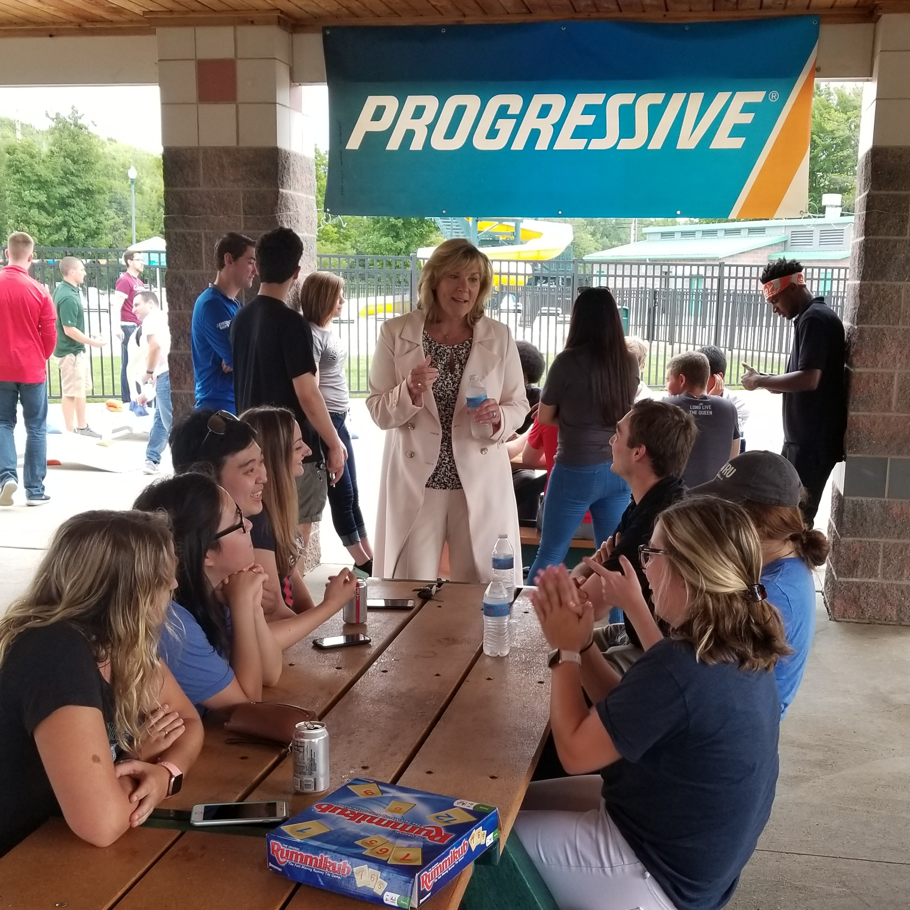

<!-- Main -->

<!-- One -->
<section id="one">
	

		<!-- Content -->
		<h2 id="content">Getting the Job</h2>
		
I initially engaged Progressive at the annual Engineering Expo, the biggest career fair for OSU engineers. I actually saw Progressive the year before, but they turned me away because I wasn't a junior or senior. I talked about my <a href="projects">projects</a> and talked about my academics and managed to leave a good impression. I got a request for a follow-up phone interview the next day, where I was asked more questions about my technical abilities. A few days later, I was invited to an on-site interview along with about 30 other candidates. I interviewed with 2 different managers from various teams at Progressive. We were also treated to dinner and a tour of Progressive's art collection. A few days later, the intern manager called me to offer me the job!

		

		<h2 id="content">What I did</h2>
		
I interned in Progressive's Native Mobile Apps division. Because I was an intern, I was assigned a special project to work on throughout the summer that I would complete alongside the work I did for my team. My project was to research Kotlin, a new programming language developed by Jetbrains for building Android apps. Traditionally, Android apps were written in Java, a general purpose object-oriented language that has been around for several decades. This new language was intended to bring a modern, specialized language to the Android platform. Progressive was considering switching to this language so they wanted me to investigate it's properties and how it could be incorporated into the existing codebase. At the end of the summer, I delivered a presentation on my findings to key stakeholders of the platform, including the Technical App Owner, Project Sponsor, and Domain Architect. I also compiled over 100 pages of documentation on my findings. When I wasn't working on my project, I was fixing bugs with the management team or working on the latest features with a delivery team.

		
My work was not constrained to MNA. I also got the change to collaborate with several other interns on separate project. The team I was placed on was tasked with building an Alexa skill that was capable of reading business reports and financial results based on various parameters. Throughout the project we were able to experiment with natural language processing and other methods of translating hard data into coherent English. The end product was capable of reading various reports from a DynamoDB instance for various quarters and years. We presented this project at the Intern Project Expo at the end of the summer.  

		
		

				<i>From left to right: Danny Mostow, Zach Allegretti, Corey Robinson, Mathew Partin. Not pictured: Nick Pappas.</i>
		

	

</section>
<section id="two">
	

		<header class="major">
			<h2>Intern Events</h2>
		</header>
		
My time at Progressive wasn't always spent working. There were several intern events and department outings planned throughout the summer. These experiences are a big part of what made my time at progressive so special.

	

</section>
<section id="three" class = "spotlights">
	<section>
		
		

			

				<header class="major">
					<h3>Rock Hall</h3>
				</header>
				
The Rock and Roll Hall of Fame is one of Cleveland's greating attractions, so no summer in Northeast Ohio is complete without a visit. Progressive arranged a day for all of the interns to visit (during work hours!). Naturally, this was also a great photo op since all of the interns were together. As part of the event, they set up a scavenger hunt across the building. As a native of the area, I used my wide knowledge of rock to lead my team to victory! The rock hall is an awesome attraction, and I think everyone should visit at some point

				<ul class="actions">
					<li><a href="https://www.rockhall.com/" class="button">Learn More</a></li>
				</ul>
			

		

	</section>
	<section>
		
		

			

				<header class="major">
					<h3>Cleveland Indians</h3>
				</header>
				
As the owners of Progressive Field, perhaps its no surprise that the interns were treated to club seats to an Indians game. The weather was beautiful that night and our seats were awesome! Around the same time was Progressive weekend, where many of the employees got free tickets and other goodies. One of my teammates was nice enough to give me his tickets, so I got to go to a second game with my mother. 

				<ul class="actions">
					<li><a href="http://cleveland.indians.mlb.com/cle/history/year_by_year_results.jsp" class="button">How are the Indians doing?</a></li>
				</ul>
			

		

	</section>
	<section>
		
		

			

				<header class="major">
					<h3>Other Events</h3>
				</header>
				
There were plenty of other fun outings throughout the summer, including but not limited to:

				<ul>
					<li>Intern Picnic</li>
					<li>Bocce Tournament</li>
					<li>Q&A with CEO, CTO, CFO</li>
					<li>Data center tours</li>
				</ul>
			

		

	</section>

</section>

<section id="four">
	

		<header class="major">
			<h2>Takeaways</h2>
		</header>
		
Progressive gave me everything that I wanted and more. They put me on an awesome team on a platform that I'm passionate about and gave me an awesome project to work on thoughout the summer. Everyone that I worked with: my manager, my mentor, and even my teammates were a lot of fun to work with and extremely supportive of me. The few months that I spent there gave me the critical experience that I needed to transition into the software industry. Progressive truly is a company that cares about its employees, and I will forever be grateful for the opportunity.

		
Here is a summary of everything I learned/achieved

		<ul>
			<li>An in-depth understanding of Kotlin, including benefits and drawbacks, methods of incorporation, and its place in Android development.
			<li>How to build and deploy an Alexa skill from start to finish as well as all of the components, including AWS Lambda.
			<li>Real experience working on an Agile team.
			<li>Source control at a corporate level.
			<li>How to work independently while still producing impact. 
		</ul>
		
	

</section>

