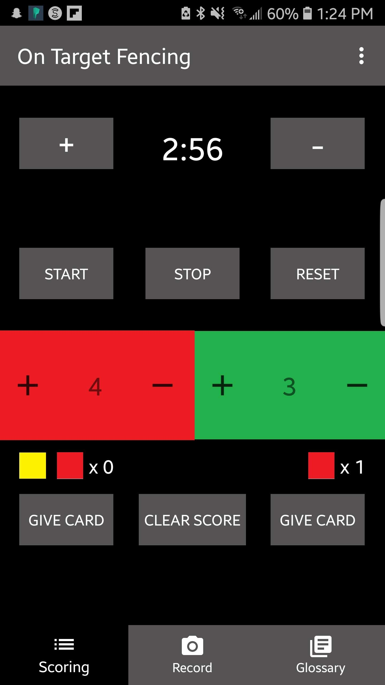
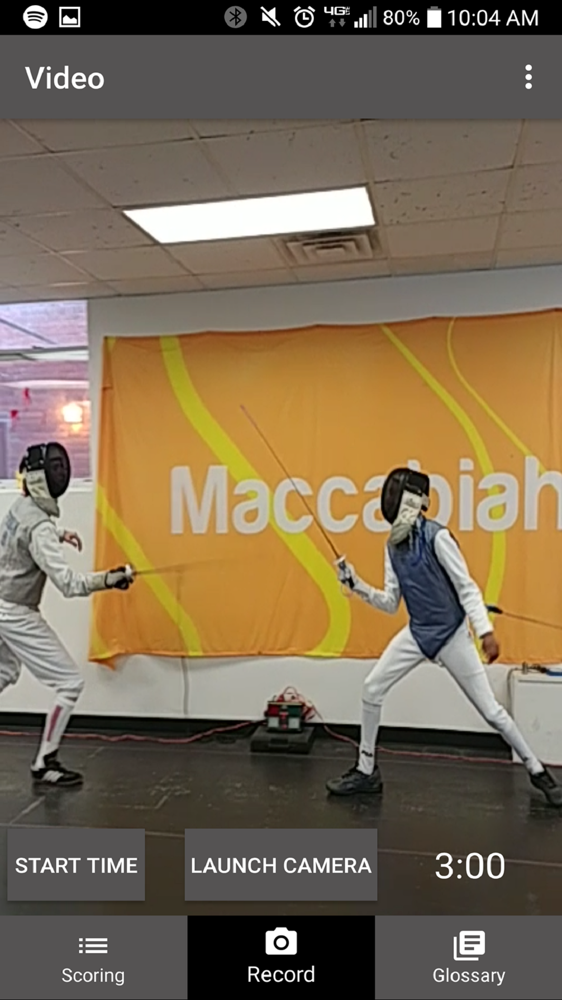
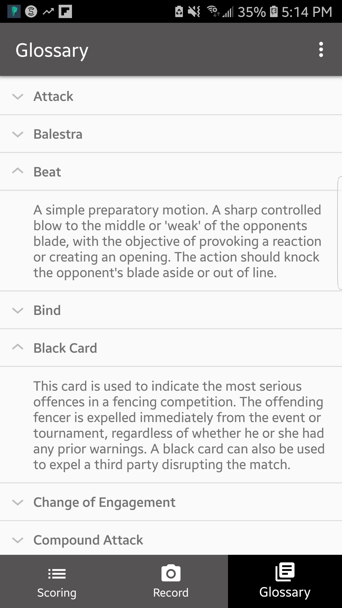

		

			

			

			

		

<section id="one">
		

			<!-- Content -->
			<h2 id="content">Background</h2>
			
This was a solo project that I built in the Summer of 2017 after my sophomore year at OSU. My internship hopes didn't quite pan out how I wanted them to, so I wante to make the best of the situation by starting an ambitious project. It may not be as technically impressive as some of the other projects that I've built, but its important to me because it's the first Android app that I built and published.

			
I got the idea for the app after looking on the Google Play Store for similar apps. I knew I wanted to build a fencing app because fencing is sort of a niche interest. There were a handful of apps on the store, but none of them had video recording. This was my chance to actually make something new.

		

</section>
<section>
		

			<h2> Challenges </h2>
			<dl>
				<dt>Learning Android</dt>
				<dd>
					
Being my first exposure to Android, it was quite overwhelming trying to learn the basics Even though I was comfortable with Java, the learning curve was steep. Fortunately, the Android docs are very useful and there is a plethora of resources online for getting started. 

				</dd>
				<dt>Video Playback</dt>
				<dd>
					
This was easily the most challenging feature of the app. I got kind of stuck on this for a couple weeks because it never seemed to be working quite right. The video was always either improperly sized, it 

				</dd>
				<dt>Timekeeping</dt>
				<dd>
					
In order for the app to be usable, the timer needs to keep running between activities and when video is being recorded. Furthermore, the state of the timer (i.e running or stopped) needs to be known as well. This created a lot of edge cases that were tricky to resolve.

				</dd>
			</dl>
		

</section>
<section class = "spotlights">
		<section>
			

				<h2>Results</h2>
				
This app is still live on the Google Play Store! I'm not actively working on it anymore, but it still funtions normally. It's completely free to download and there are no adds or purchases, so give it a shot!

				<ul class="actions"> 
					<li><a href="https://play.google.com/store/apps/details?id=com.allegretti.zach.OnTargetFencing&hl=en" class="button special">Download on Google Play</a></li>
				</ul>		
			

		</section>
	</section>
	
