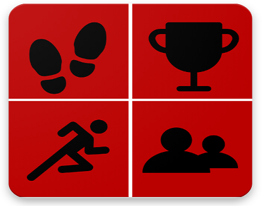

<!-- Main -->

<!-- One -->
<section id="One" class="spotlights">
	<section>
		
		

			

				<header class="major">
					<h3>FitRace</h3>
				</header>
				
Originally a class project, FitRace is the 2nd Android app I published on the Google Play Store. The goal of the app is to "gamify" fitness throught the use of time trials, experience points, challenges, and level ups 

				<ul class="actions">
					<li><a href="fitrace.html" class="button">Learn more</a></li>
				</ul>
			

		

	</section>
	<section>
		
		

			

				<header class="major">
					<h3>AuxNet</h3>
				</header>
				
AuxNet is a messaging application that uses mesh networking to allow users to communicate without a network connection. My friends and I built this at HackOHI/O 2018, where we won Most Impactful and 3rd place overall.

				<ul class="actions">
					<li><a href="auxnet.html" class="button">Learn more</a></li>
				</ul>
			

		

	</section>
	<section>
		
		

			

				<header class="major">
					<h3>Sed nunc ligula</h3>
				</header>
				
Nullam et orci eu lorem consequat tincidunt vivamus et sagittis magna sed nunc rhoncus condimentum sem. In efficitur ligula tate urna. Maecenas massa sed magna lacinia magna pellentesque lorem ipsum dolor. Nullam et orci eu lorem consequat tincidunt. Vivamus et sagittis tempus.

				<ul class="actions">
					<li><a href="generic.html" class="button">Learn more</a></li>
				</ul>
			

		

	</section>
</section>

<!-- Three -->
<section id="three">
	

		<header class="major">
			<h2>Massa libero</h2>
		</header>
		
Nullam et orci eu lorem consequat tincidunt vivamus et sagittis libero. Mauris aliquet magna magna sed nunc rhoncus pharetra. Pellentesque condimentum sem. In efficitur ligula tate urna. Maecenas laoreet massa vel lacinia pellentesque lorem ipsum dolor. Nullam et orci eu lorem consequat tincidunt. Vivamus et sagittis libero. Mauris aliquet magna magna sed nunc rhoncus amet pharetra et feugiat tempus.

		<ul class="actions">
			<li><a href="generic.html" class="button next">Get Started</a></li>
		</ul>
	

</section>

