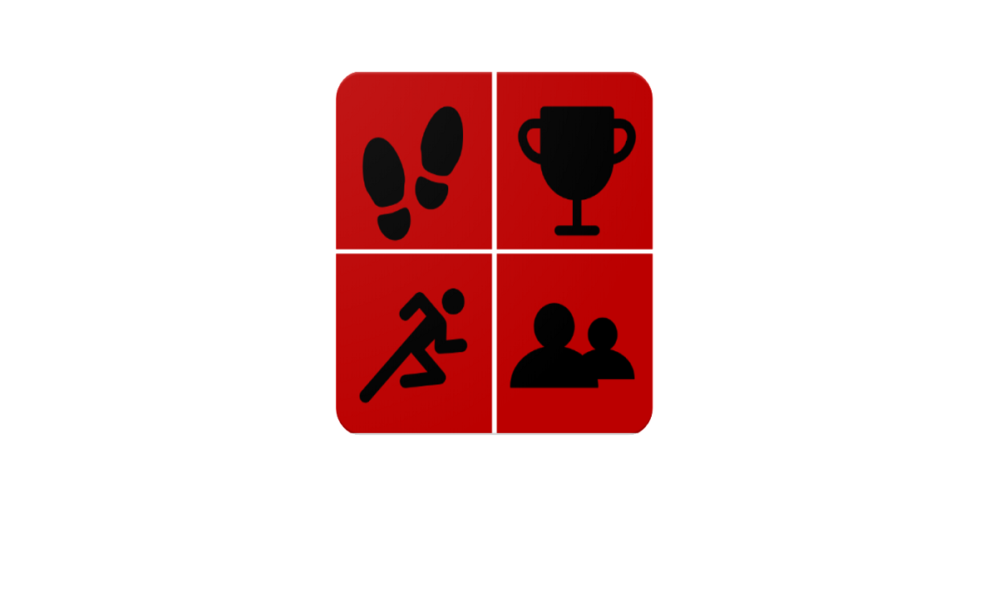
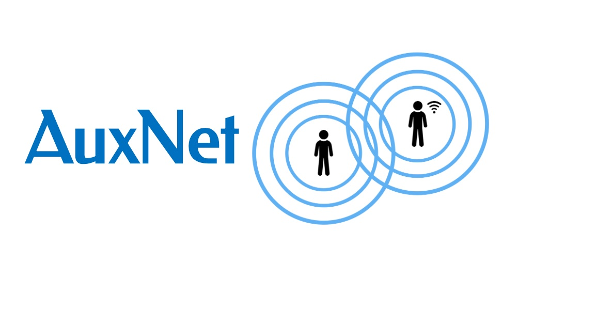
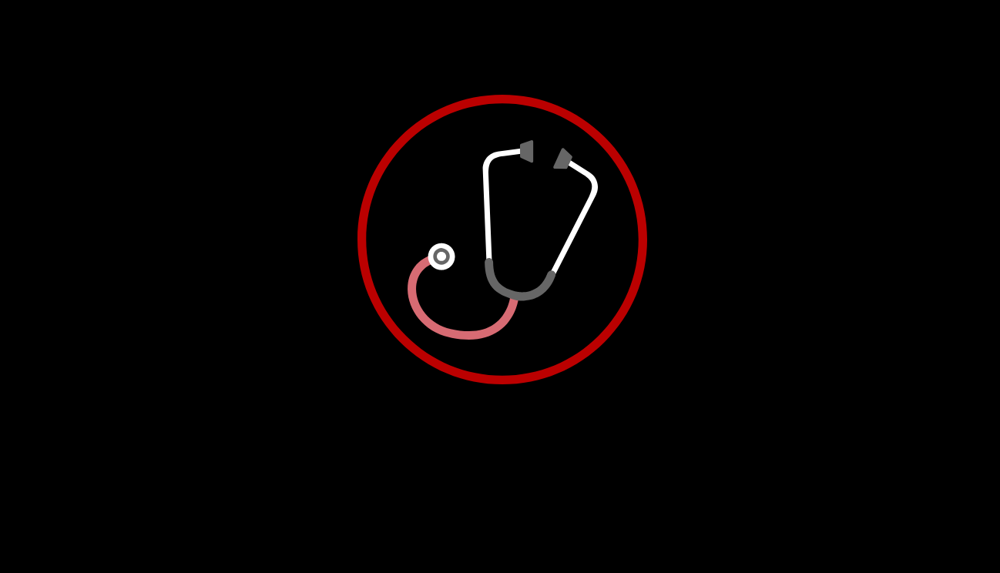
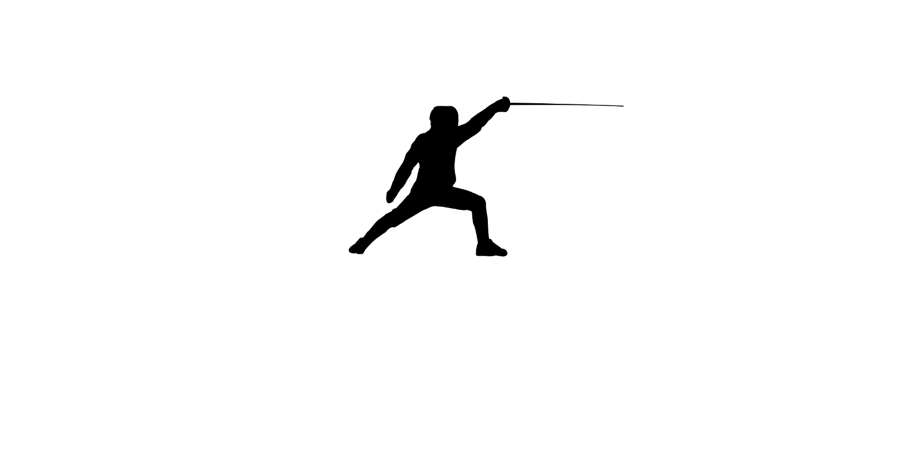
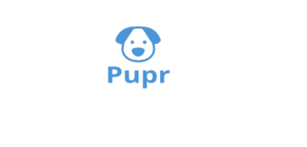

<!-- Main -->

<!-- One -->
<section id="One" class="spotlights">
	<section>
		
		

			

				<header class="major">
					<h3>FitRace</h3>
				</header>
				
Originally a class project, FitRace is the 2nd Android app I published on the Google Play Store. The goal of the app is to "gamify" fitness throught the use of time trials, experience points, challenges, and level ups 

				<ul class="actions"> 
					<li><a href="fitrace.html" class="button">Learn more</a></li>
					<li><a href="https://play.google.com/store/apps/details?id=com.harshil.zach.fitnesstracker&hl=en_US" class="button special">Download on Google Play</a></li>
				</ul>
			

		

	</section>
	<section>
		
		

			

				<header class="major">
					<h3>AuxNet</h3>
				</header>
				
AuxNet is a messaging application that uses mesh networking to allow users to communicate without a network connection. My friends and I built this at HackOHI/O 2018, where we won Most Impactful and 3rd place overall.

				<ul class="actions">
					<li><a href="auxnet.html" class="button">Learn more</a></li>
					<li><a href="https://hack.osu.edu/2018/live/winners.html" class="button">HackOhi/o Results</a></li>
				</ul>
			

		

	</section>
	<section>
		
		

			

				<header class="major">
					<h3>Clinical Tracker</h3>
				</header>
				
This project was my senior capstone project. It is a mobile app built to help nursing instructors evalutate their students.

				<ul class="actions">
					<li><a href="clintrac.html" class="button">Learn more</a></li>
				</ul>
			

		

	</section>
	<section>
		
		

			

				<header class="major">
					<h3>On Target Fencing</h3>
				</header>
				
My first foray into Android development, On Target Fencing is a scorekeeping app designed to help fencing referees keep track of bouts.

				<ul class="actions">
					<li><a href="ontarget.html" class="button">Learn more</a></li>
					<li><a href="https://play.google.com/store/apps/details?id=com.allegretti.zach.OnTargetFencing&hl=en_US" class="button special">Download on Google Play</a></li>
				</ul>
			

		

	</section>
	<section>
			 
		

			

				<header class="major">
					<h3>Pupr</h3>
				</header>
				
Pupr is a web platform for looking at dogs.

				<ul class="actions">
					<li><a href="pupr.html" class="button">Learn more</a></li>
				</ul>
			

		

	</section>
</section>

<!-- Three -->
<section id="three">
	

		<header class="major">
			<h2>Other Projects</h2>
		</header>
		
Here are some other projects that I've worked on that I think are noteworthy, but not as cool as the ones listed above.

		<ul>
			<li><b>Pi-Spy: </b> A pair pair of glasses that can take photos and videos. Built at HackOHI/O 2017.</li>
			<li><b>LiftMath: </b> an app for easily calculating the weights you need for lifting</li>
			<li><b>2048 Clone:</b> Class project for Information Security, this app looks like 2048 on the surface, but it actually reads your personal data and uploads it to a cloud database. </li>
			<li><b>Buckeye Fencing Club Site: </b> I served as a web officer for the fencing club and built new website for them </li>
		</ul>
	

</section>

