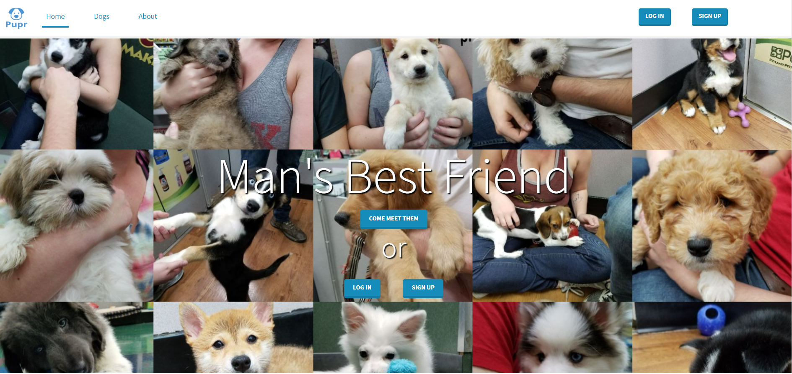

<section id="one">
		

			<!-- Content -->
			<h2 id="content">Background</h2>
			
There was a time where Joe Forsman, Sabrina Poulsen, and I were regularly visiting the Petlands in the area to play with dogs. During this period we got the idea to build a web catelogue for all of the dogs, which eventually evolved into Pupr. Pupr lets you look at all of the dogs that we have encountered in our Petland adventures. Each dog has their own page with a photo gallery and description. Users can favorite and comment on each dog. You can even submit your own dog if you provide the proper information. 

		

			

			<h2>The Team</h2>
		

		<ul class="actions">
					<li><a href="https://www.linkedin.com/in/zachary-allegretti-37ba18154/" class="button special" style = "margin: 1em">Zach Allegretti</a></li>
					<li><a href="https://www.linkedin.com/in/joseph-forsman-5a73a6148/" class="button special" style = "margin: 1em">Joe Forsman</a></li>	
		</ul>
</section>
<section class = "spotlights">
		<section>
			

				<h2>Technology Used</h2>
				<ul>
					<li>Node.JS</li>
					<li>MySQL</li>
					<li>Express.JS</li>
					<li>AWS</li>
					<li>Passport.JS</li>
				</ul>
			

		</section>
</section>

	

		

			

			

			

			

			

		

	

<section>
		

			<h2> Challenges </h2>
		<dl>
		<dt>Dog Submissions</dt>
			<dd>
				
Without being able to submit your own dogs, the reasons to make an account on Pupr are somewhat limited. The ability to submit new dogs would allow the site to be contiously refreshed with new user content without our intervention. However, there are a lot of logistics to figure out. For example, all incoming content needs to be screened and approved by a real person before it can be directly added into our database. The solution we ended up coming up with was to add all submitted content into a temporary database which would be manually reviewed by someone before it could be transferred. Project development stopped around this time.

			</dd>
			<dt>Breed Identification</dt>
			<dd>
				
There are a lot of dog breeds out there, so naturally figuring out which breed maps to which dog is a challenge. Furthermore, the popularity of mixed breeds means that many dogs may have 2 or more breeds associated with them. To handle dog breeds, we used a pre-existing list and processed it into our database using a Python script. For future enhancement, we could use an image recognition library or API, such as Microsoft's <a href = "https://www.what-dog.net/">What-Dog</a> to do this for us 

			</dd>
			<dt>Data Insertion</dt>
			<dd>
				
After our petland adventures we had a bunch of dog photos, but no actual content. We needed a way to fill our database with all of the relevant information for each of the dogs. To avoid the manual labor of manually inserting all of the dogs, we wrote a text file for each dog that had its name, breed info, biography, and filepaths for photos. We then wrote a script that would parse all of these files and perform the necessary database operations. The biggest benefit of this is that we could easily update the dogs by updating these files and running the appropriate script.

			</dd>
		</dl>
		

</section>
<section class = "spotlights">
		<section>
			

				<h2>Results</h2>
				
Because we were broke college students and web hosting gets expensive, Pupr is no longer publically available. Regardless, it was a fun project and it was definitely worth it for the chance to learn Node.JS.
	
			

		</section>
	</section>
