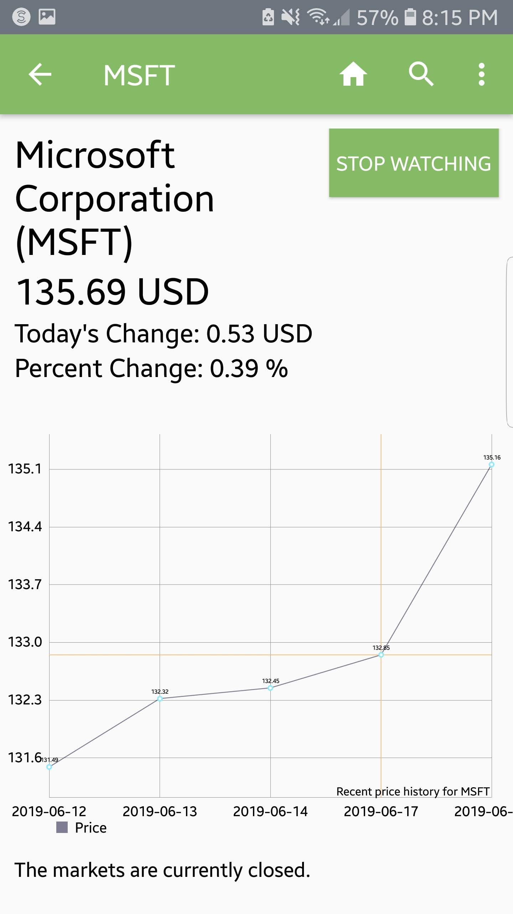
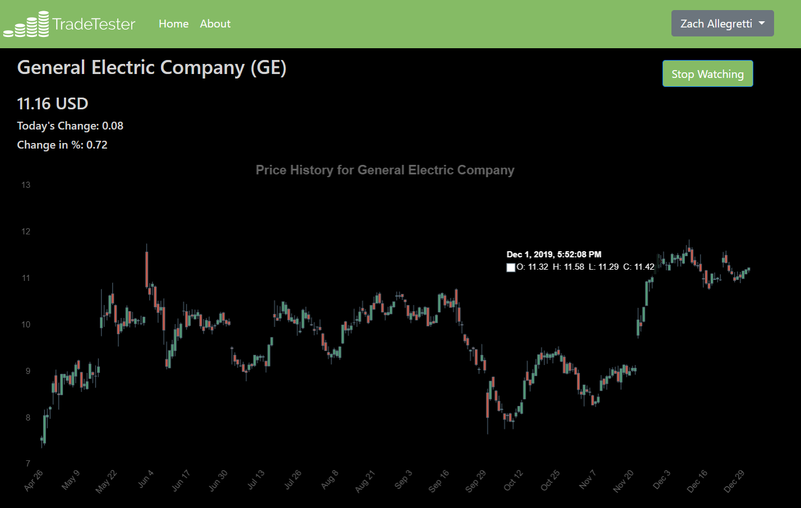
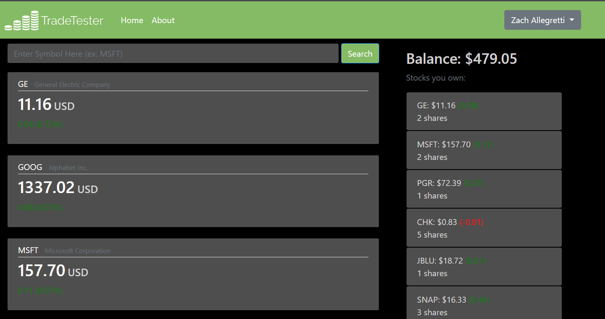

		

			

			

			

		

<section id="one">
		

			<!-- Content -->
			<h2 id="content">Background</h2>
			
After I graduated from OSU in 2019, I had a few months before I could start, so I decided to build something bigger than anything I had done in the past. My main goal was to utilize my experience with firebase to develop something cross-platform between mobile and web. ALthough I was working with a lot of familiar technologies, I still wanted to learn something new in the process, so I decided to learn a new web framework. I also wanted to work with a variety of different APIs to make the app seem as realistic as possible.  

            
I drew a lot of inspiration from Robinhood when I was designing the UX for this application. I loved the clean, modern style as well as the after-hours dark mode feature (which I even incorporated into TradeTester for web). Partway through the development process, I decided to pivot the focus towards education by adding a teachers dashboard. 

		

</section>

<section class = "spotlights">
    <section>
        

            <h2>Technology Used</h2>
            <ul>
                <li>Android Studio</li>
                <li>Firebase</li>
                <li>Django</li>
                <li>Heroku</li>
            </ul>
        

    </section>
</section>

	

		

			

			

			

			

		

	

<section>
		

			<h2> Challenges </h2>
		<dl>
		<dt>Learning Python and Django</dt>
			<dd>
				
There is always a technical barrier to overcome when learning a new language. There is an even bigger barrier when learning a new web framework in the process. It took me a while to get used to the framework, but fortunately there are a lot of great online resources for learning Django. I used a video series on YouTube, which can be found <a href="https://www.youtube.com/watch?v=UmljXZIypDc&list=PL-osiE80TeTtoQCKZ03TU5fNfx2UY6U4p">Here</a> . 

			</dd>
			<dt>Database Cross Compatibility</dt>
			<dd>
				
By utilizing Firebase's web and mobile compatibility, I was able to make the mobile and web applications completely compatible so users can log onto both platforms with the same account. Of course, this was no easy task. I used a Firebase wrapper called Pyrebase to make it easier to use Pyrebase on the web side.

			</dd>
			<dt>Leveraging APIs</dt>
			<dd>
				
I utilized several APIs in order to acquire the realtime data that runs TradeTester. In order to acquire all of the data that is available to the user, I had to asynchronously pull from several different APIs in order to provide the comprehensive market data that makes TradeTester practical. I had to setup these API calls on both the Android and Django apps.

			</dd>
		</dl>
		

</section>

<section class = "spotlights">
		<section>
			

				<h2>Results</h2>
				
Both TradeTester web and TradeTester for Android are deployed and currently functional. The web app is hosted on Heroku and the Android app is available on Google Play.

				<ul class="actions"> 
					<li><a href="http://tradetester.herokuapp.com/" class="button">Website</a></li>
					<li><a href="https://play.google.com/store/apps/details?id=com.zachary.alleg.tradetester&hl=us" class="button special">Download on Google Play</a></li>
				</ul>		
			

		</section>
	</section>